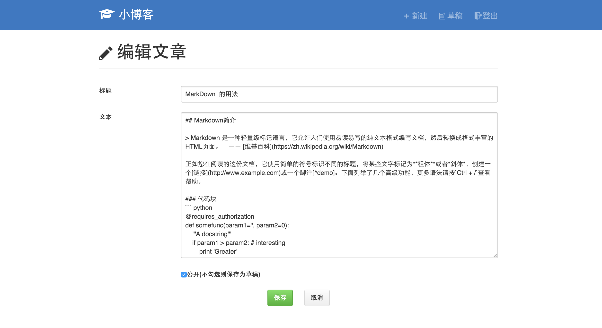

# Simple-Blog-With-Flask

>  基于Python+Flask 制作的小型简单博客应用。为本人的课程设计拙作。
>  拥有基本的登录登出、写文章、新建文章、编辑文章等功能。

## 基本构成

### 使用到的编程语言

Python、HTML、CSS、JavaScript

### 使用到的框架

Flask、peewee、jQuery、Primer

### 数据库

SQLite

## Screenshot

## 文件结构
	.
	├── app.py  基本文件
	├── config.py 配置文件
	├── data 数据库文件夹
	├── model.py 核心类文件
	├── requirements.txt 必需安装模块清单
	├── static 静态文件夹
	│   ├── css
	│   ├── fonts
	│   ├── img
	│   ├── js
	└── templates 模板文件
 

## 使用方法

1. 通过`git clone` 下载本rep

		git clone https://github.com/Jeff2Ma/Simple-Blog-With-Flask
	

2. 通过虚拟沙盒方式运行激活

		virtualenv Simple-Blog-With-Flask
		cd Simple-Blog-With-Flask/
		source bin/activate
		
3. 安装相关模块
		
		pip install -r requirements.txt
		
4. 启动本地服务器

		python app.py
		
5. 最后通过 http://127.0.0.1:5000/ 访问即可。
		
## 使用到的Python 库（第三方模块）

- BeautifulSoup==3.2.1
- Flask==0.10.1
- itsdangerous==0.24
- Jinja2==2.8
- Markdown==2.6.4
- MarkupSafe==0.23
- micawber==0.3.3
- peewee==2.6.4
- Pygments==2.0.2
- Werkzeug==0.11
- wheel==0.24.0

## TODO

- 相关输入框的后端验证功能

- 评论框

- 文章标签功能

- 多用户、用户管理功能

